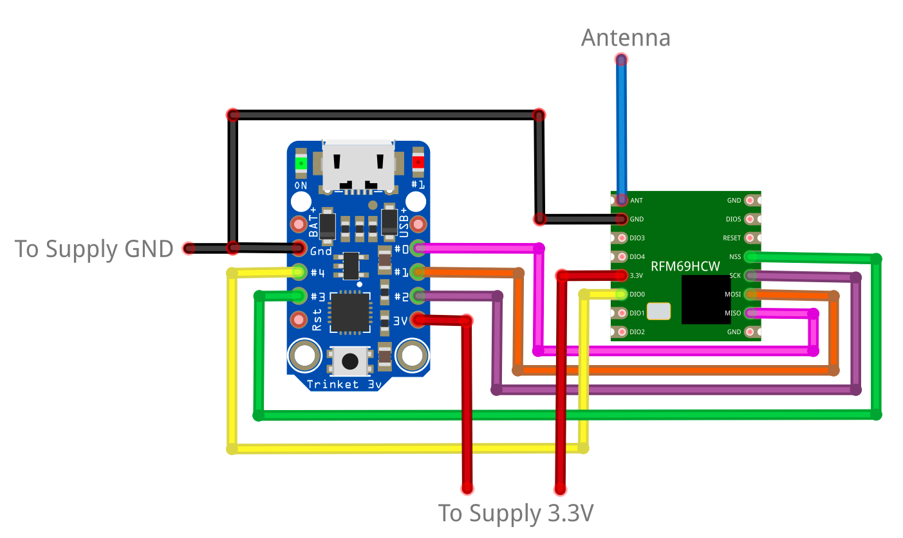

# Texting Dryer Node
Adafruit Trinket node that sends messages to the [gateway](https://github.com/makercrew/texting_dryer_gateway) to indicate end-of-cycle.

## Wire it Up

## Setup Arduino IDE
The Arduino IDE needs to be configured to recognize and program the Trinket 
board. You can follow the instructions found [on the Adafruit website](https://learn.adafruit.com/adafruit-arduino-ide-setup/overview).
You can also watch the walkthrough video showing you step by step.

## Program the Trinket
  1. Open [dryer_node.ino](dryer_node/dryer_node.ino) in the Arduino IDE
  2. Uncomment the [define for ENCRYPT_KEY](https://github.com/makercrew/texting_dryer_node/blob/c00da230ec624bd9927bfc01fec92897e0d542ee/dryer_node/dryer_node.ino#L20) and set it to any 16 character ASCII string
  3. Set FREQUENCY to `RF69_433MHZ`, `RF69_868MHZ` or `RF69_915MHZ` depending 
  on your version of the RFM69 module.
  4. If your RFM69 module is not the high power version comment out [IS_RFM69HW_HCW](https://github.com/makercrew/texting_dryer_node/blob/c00da230ec624bd9927bfc01fec92897e0d542ee/dryer_node/dryer_node.ino#L27)
  5. Select the **Adafruit Trinket 8MHz** board from the **Tools->Board** menu.
  6. Select **USBtinyISP** from the **Tools->Programmer** menu. 
  7. Program the board by clicking **Sketch->Upload Using Programmer**.
 
> **IMPORTANT**: Make sure to use **Upload Using Programmer** and not **Upload** 
from the Sketch menu.

## How It Works
The Trinket is programmed to immediately send a JSON message over the RFM69 
module when it is powered on. It will send a single message and then go into 
deep sleep mode until it is reset. When hooked up to the dryer buzzer this 
will cause the Trinket to power on at the end of cycle to send a message.
